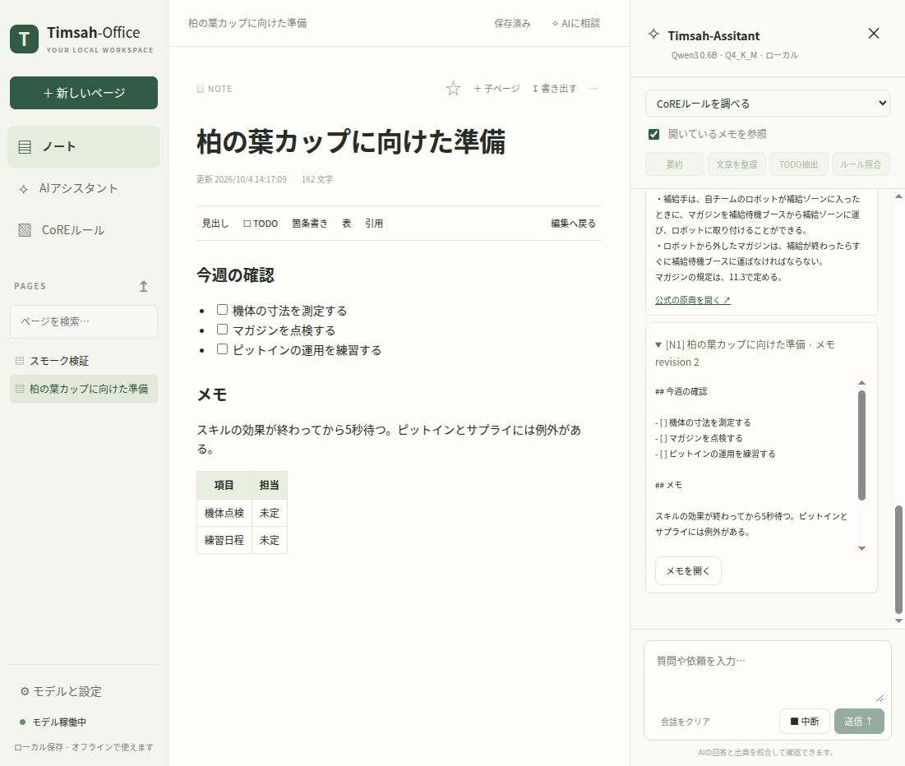

# Timsah-Office

ローカルで使う日本語AIワークスペース。Notionのようにメモをページで整理し、**Timsah-Assitant** に要約・文章整理・TODO抽出・CoRE-2ルール調査を頼めます。公式ルールの検索、AIハーネス、llama.cpp、専用Web UIを .NET 10 のアプリにまとめています。



## ダウンロードと起動

[Releases](https://github.com/jrt-timsah-org/Timsah-Office/releases) の自分のOSに合う **offline** パッケージを展開し、起動ファイルを実行してください。**.NET 10 / ASP.NET Runtime、llama.cpp、Qwen3 0.6B、公式ルールのスナップショットを同梱**。SDK・Python・Node・クラウドAPIキーは不要です。初回からオフラインでメモ・検索・推論を使えます。

| OS | パッケージ | 起動ファイル |
| --- | --- | --- |
| Windows x64 | `win-x64-offline.zip` | `Start-Timsah-Office.cmd` または `Timsah-Office.exe` |
| Linux x64 | `linux-x64-offline.tar.gz` | `Start-Timsah-Office.sh` |
| macOS Apple Silicon | `osx-arm64-offline.tar.gz` | `Start-Timsah-Office.command` |
| macOS Intel | `osx-x64-offline.tar.gz` | `Start-Timsah-Office.command` |

起動すると `http://127.0.0.1:5273` の専用UIを標準ブラウザで開きます。ブラウザを閉じてもバックエンドは継続します。終了するには「モデルと設定 → アプリを終了」、または起動したターミナルで `Ctrl+C`。macOS配布は署名・公証されていません。対応するOSの信頼済みアプリの起動方法に従ってください。

LinuxはUbuntu 22.04相当以降（glibc 2.35以降）、macOSは .NET 10 の対応OS、WindowsはWindows 10/11 x64を対象とします。OSにブラウザが必要です。Linuxの最小環境では.NET/llama.cpp用の標準ランタイムライブラリ（libstdc++、libgomp、ICUなど）が必要です。

`lite` を自分で作成した場合は、Runtime・エンジン・ルールを同梱し、モデルを含みません。「モデルと設定」でモデルを取得してから起動してください。

## メモとAI

- **ページ**: 階層化、お気に入り、本文検索、自動保存、Markdown編集／プレビュー、見出し・表・チェックリストの挿入。
- **持ち出し**: `.md` / `.txt` 読み込み、ページのMarkdown書き出し、全ページのJSON書き出し。
- **AI**: 選択範囲またはページ全体の要約、文章の整理、TODO抽出、公式ルールとの照合、自由な相談。
- **提案の反映**: 回答をコピー、開いているページへ末尾挿入、新しいページに保存。AIが本文を勝手に書き換えることはありません。
- **根拠**: 参照した公式条文は版・URL・実際にモデルへ渡した抜粋を表示。個人メモは `[N1]` で別扱い。

メモはサーバー側のJSONへ保存し、更新番号で上書き競合を検出します。直前の状態は `notes.json.bak` に保存。未保存の編集内容はブラウザに下書きを残し、再読込時に復元を選べます。AIの会話表示はタブ内の一時データです。残したい回答はメモへ保存してください。

TODO抽出では、参照した本文に `- [ ]` のチェックリストがある場合、未完了項目をそのまま抽出するハーネスの処理を使います。自由文からの抽出はモデルが行います。

## モデルとRAM管理

| 選択モデル | GGUFのサイズ | 用途 |
| --- | ---: | --- |
| Qwen3 0.6B Q4_K_M | 397 MB | 既定・オフライン配布に同梱。軽量な試用向け |
| Qwen3 1.7B Q4_K_M | 1.11 GB | 日本語での説明・メモ整理 |
| Gemma 4 E2B Q4_K_M | 3.11 GB | より複雑な質問や文書の整理 |
| Gemma 4 E4B Q4_K_M | 4.98 GB | RAMに余裕があるPC向け |

モデルのサイズに加えてコンテキスト／計算バッファ／RuntimeのRAMを使います。表の値はダウンロードする重みのサイズで、RAMの上限ではありません。カスタムGGUFも絶対パスで指定できます。カスタムモデルは使用するテンプレートやllama.cpp対応状況に依存します。

**CPUのみ、RAM直接ロード、4096トークン、非thinking**が既定。設定でメモリマップ、スレッド数、コンテキスト長、最大出力、アイドル時間を変更できます。複数のモデルを同時に常駐させません。モデルを停止してから設定を保存し、「取得」「起動」の順で切り替えてください。

**15分の待機後にモデルを自動アンロード**します（無効、1、5、15、30、60、120、240分を選択可能）。生成中は保持し、回答完了時から待機時間を数えます。次の依頼で自動再ロードします。手動で「停止」した場合は自動再ロードせず、「起動」を操作してください。5秒間隔で待機判定するため、指定時刻から最大約5秒遅れます。

モデル取得とルール更新はインターネット接続を使用します。モデルはHugging Face、エンジンはGitHubの公開ファイルから取得。URLは不変のコミット／リリースに固定し、サイズとSHA-256を検証します。中断・失敗時に不完全なファイルは有効化しません。**メモや質問を外部の推論サービスへ送信しません。**

## CoREの出典

2026-10-04時点の193条文を同梱しています。

- [CoRE-2ルールナビ V27.2.0](https://core.scramble-robot.org/rule/core-2-rulenavi/)（2026-09-24発行）をCoRE-2の基準に採用。
- [CoRE共通ルールブック v26.1.0](https://github.com/scramble-robot/CoRE-Rulebook/blob/dc584ffffa58028774b92454f292de9386ef1ea8/core_common_rulebook.md)。
- [CoRE競技システムルールブック v26.1.0](https://github.com/scramble-robot/CoRE-Rulebook/blob/dc584ffffa58028774b92454f292de9386ef1ea8/core_gamesystem_rulebook.md)。

公式GitHubのCoRE-2 PDF v27.1.0より新しいルールナビを優先し、両方を混在させません。ルールは重みに学習させず、更新可能な出典として検索・参照します。外部リンク先、図、CAD、実物の機構、最新の審判裁定は自動取得して判断する対象に含みません。軽量モデルの説明には誤りや条件の省略があり得るため、出典カードの原文と照合してください。出典番号の検査は「番号が実在するか」の検査であり、回答全体の正しさを保証するものではありません。

「公式資料と更新」で、全資料の取得・パース・検証が成功した時だけ新しいスナップショットへ切り替えます。ページ構造が変わったり、通信が失敗した場合は既存の資料を保持します。上流の所有権・ライセンスと第三者の素材については [THIRD_PARTY_NOTICES.md](THIRD_PARTY_NOTICES.md) を参照してください。

## 保存先と起動オプション

保存先はOSのローカルアプリデータ配下の `Timsah-Office`。正確なパスは設定画面に表示します。そこに `notes.json`、`notes.json.bak`、`settings.json`、更新済み `rules.json`、追加モデル、エンジンログを保存します。同じ保存先の複数プロセス起動は排他します。

```sh
./Timsah-Office --port 5274 --data /absolute/path/to/my-workspace
./Timsah-Office --no-browser --no-autostart
./Timsah-Office --version
```

`--port 0` は空きポートを自動選択。`--bundle` は同梱アセットのディレクトリ、環境変数 `TIMSAH_OFFICE_DATA` は保存先の既定を変更します。アプリはループバックのみで待ち受け、Host/Origin/ランダムトークンでローカルAPIを検証。llama-serverも別のループバックポートと認証キーで管理します。ログは上限付き。明示的な会話ログをハーネスは保存しません。

## 開発・リリース

.NET 10 SDK。アプリ本体のNuGet依存はなく、テストだけにxUnitを使用しています。UIはローカル同梱のJavaScript/CSSとMarked/DOMPurifyで動き、Nodeのインストールや外部CDNは実行時に必要ありません。

```sh
dotnet restore TimsahOffice.slnx --locked-mode
dotnet test TimsahOffice.slnx -c Release
dotnet run --project src/TimsahOffice.App -- --no-autostart
# 開発用のアプリが開き、モデルの取得は設定画面から操作できます。

# Runtime・llama.cpp同梱パッケージ（Python 3.12以降）
python3 scripts/package.py --rid linux-x64
# Qwen3 0.6Bも含めたオフライン一式
python3 scripts/package.py --rid linux-x64 --with-model
```

モデル・エンジンの固定情報は `config/catalog.json`。ルールの同梱スナップショット更新はリポジトリルートで以下を実行します。

```sh
dotnet src/TimsahOffice.App/bin/Release/net10.0/Timsah-Office.dll \
  --refresh-rules --bundle "$PWD" --output "$PWD/data/rules/snapshot.json"
```

`v*` タグでGitHub Actionsが4プラットフォームをテスト・self-contained publish・SHA検証・パッケージ化し、オフライン一式とSHA-256をGitHub Releaseへ公開します。ソースの構成と検証の詳細は [docs/architecture.md](docs/architecture.md)。
